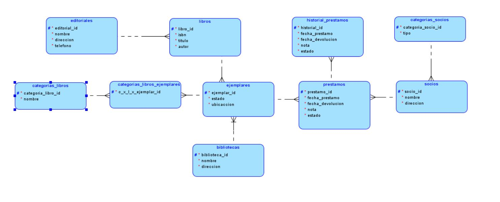
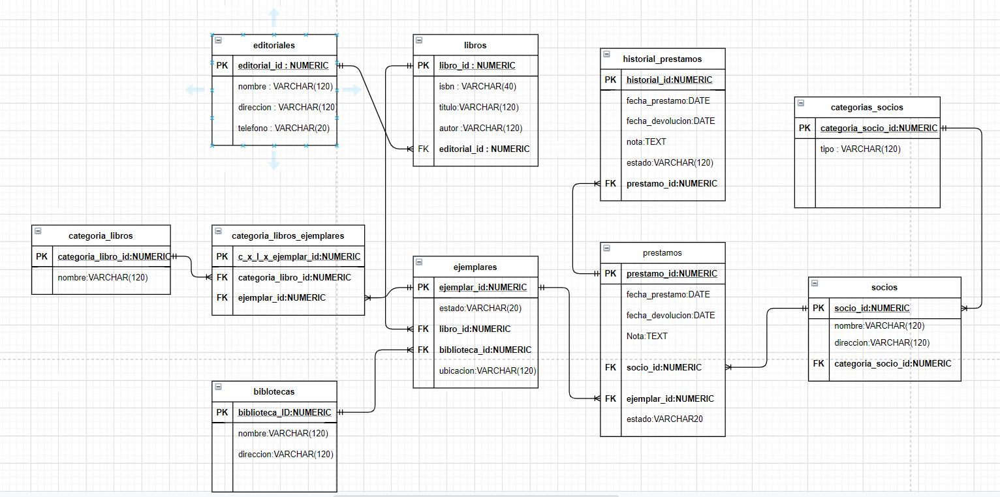
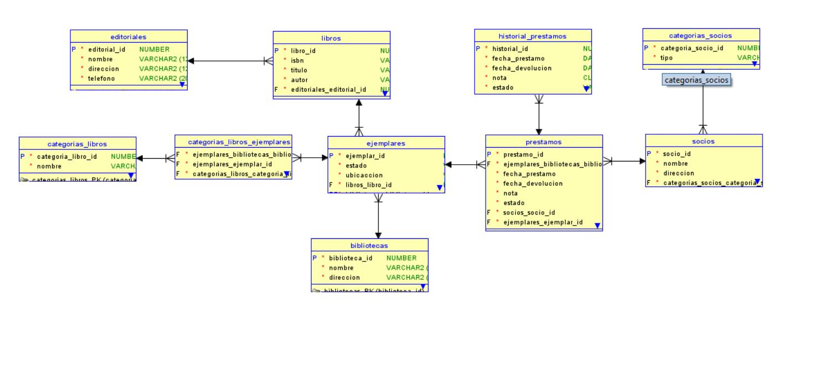
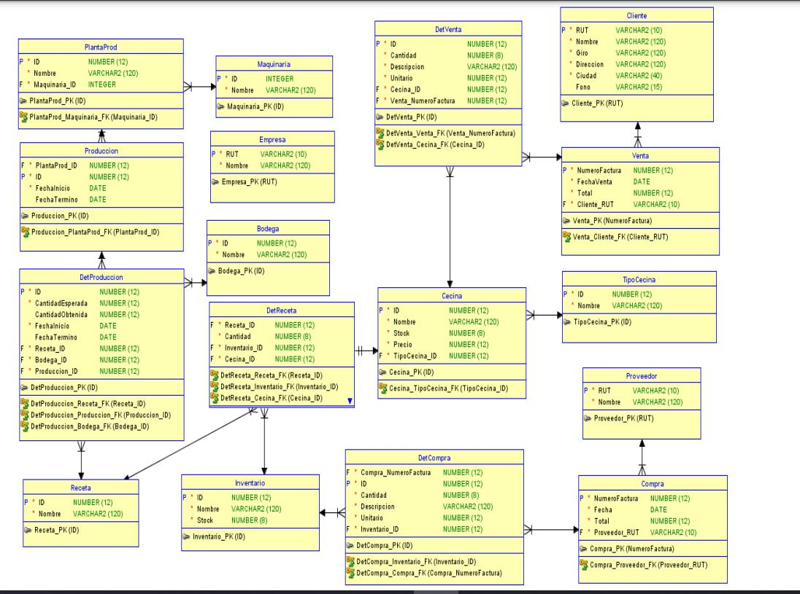

# Sistema Bibliotecario

## _Glosario Nomenclatura_
- **PK**: _Primary Key_
- **FK**: _Foreign Key_
- **UQ**: _Unique Attribute_
- **ED**: Entidad de Datos
- **EP**: Entidad Pivote
- **EC**: Entidad Catálogo

## Listado de Entidades

### editoriales  **(ED)**

- editorial_id **(PK)**
- direccion
- telefono 

### libros **(ED)**

- libro_id  **(PK)**
- isbn 
- titulo 
- autor
- editorial_id **(FK)**

### ejemplares **(ED)**

- ejemplar_id **(PK)**
- estado 
- ubicacion 
- libro_id **(FK)**
- biblioteca_id **(FK)**

### categoria_libros_ejemplares **(EP)**

- c_x_l_x_ejemplar_id **(PK)**
- categoria_libro_id **(FK)**
- ejemplar_id **(FK)**

### categoria_libros **(EC)**

- categoria_libro_id **(PK)**
- nombre

### bibliotecas **(ED)**

- biblioteca_id **(PK)**
- nombre
- direccion

### prestamos **(ED | EP)**

- prestamo_id **(PK)**
- fecha_prestamo
- fecha_devolucion
- nota
- estado
- socio_id **(FK)**
- ejemplar_id **(FK)**

### historial_prestamos **(ED)**

- historial_id **(PK)**
- fecha_prestamo
- fecha_devolucion
- nota
- estado
- prestamo_id **(FK)**

### categorias_socios **(EC)**

- categoria_socio_id **(PK)**
- tipo

### socios **(ED)**

- socios_id **(PK)**
- nombre
- direccion
- categoria_socio_id **(FK)**

## Relaciones

1. Una **editorial** tiene **libros** (_1 - M_).
1. Un **libro** tiene **ejemplares** (_1 - M_).
1. Una **biblioteca** tiene **ejemplares** (_1 - M_).
1. Un **prestamo** tiene **historial_prestamos** (_1 - M_).
1. Un **ejemplar** posee **prestamos** (_1 - M_).
1. Un **socio** tiene **prestamos** (_1 - M_).
1. Una **categoria_socio** pertenecen **socios** (_1 - M_).
1. **ejemplares** poeseen **categorias_libros** (_M - M_).

## Diagramas

### E-R Oracle

### Modelo Fisico de Base de Datos

### Modelo Fisico de Base de datos Oracle Ing.Inversa

***

## _Query contra la Base de datos_ 

### Construir las consultas para insertar, modificar y eliminar un Proveedor, Compra y Detalle Compra (DetCompra).
 

- INSERT INTO proveedor(rut,nombre) VALUES ('11223344','MTS');
- UPDATE SET nombre = 'MTC' FROM proveedor WHERE rut = '11223344';
- DELETE FROM proveedor WHERE rut = '11223344';

- INSERT INTO compra (NumeroFactura,fecha,Total,Provedor_RUT) VALUES (1234,'10-09-2024',12000,'11223344');
- UPDATE compra SET fecha = '11-09-2024' WHERE NumeroFactura = 1234;
- DELETE FROM compra WHERE NumeroFactura = 1234;

- INSERT INTO DetCompra(Compra_Numerofactura,ID,Cantidad,Descripcion,Unitario,Inventario_ID) Values (1234,1,4,'Salchichas',3,2);
- UPDATE DetCompra SET Cantidad = 3 WHERE ID = 1;
- DELETE FROM DetCompra WHERE ID = 1;

### Listar todas las ventas con los datos del cliente dado un año y mes.

SELECT v.numerofactura,v.fechaVenta,v.total,c.rut,c.Nombre,c.giro
FROM Venta v
INNER JOIN Cliente c ON c.RUT = v.Cliente_RUT
WHERE EXTRACT(YEAR  FROM v.fecha_venta) = :anio AND EXTRACT (MONTH v.fecha_venta) = :mes;

### Listar Número, Fecha y Total de todas las compras y ventas

SELECT NumeroFactura,Fecha,Total from compra
UNION 
SELECT NumeroFactura,Fecha,Total from venta;

 

### Lista todas las ventas del año 2020 que contengan las 5 cecinas más vendidas.
SELECT v.Numerofactura,v.FechaVenta,v.Total,v.Cliente_Rut,dt.cantidad,c.nombre
FROM VENTA v
INNER JOIN DetVenta dv ON v.NumeroFactura = dv.Venta_NumeroFactura
INNER JOIN Cecina c ON dv.Cecina_ID = c.ID
WHERE EXTRACT(YEAR FROM v.FechaVenta) = 2020
GROUP BY v.Numerofactura,v.FechaVenta,v.Total,v.Cliente_Rut,dt.cantidad,c.nombre
HAVING c.ID IN(
  SELECT Cecina_ID
  FROM DetVenta dv
  INNER JOIN VENTA v ON dv.Venta_NumeroFactura = v.NumeroFactura
  WHERE EXTRACT(YEAR FROM v.FechaVenta) = 2020
  GROUP BY Cecina_ID
  ORDER BY SUM(dv.cantidad) DESC
  FETCH FIRST 5 ROWS ONLY
);

